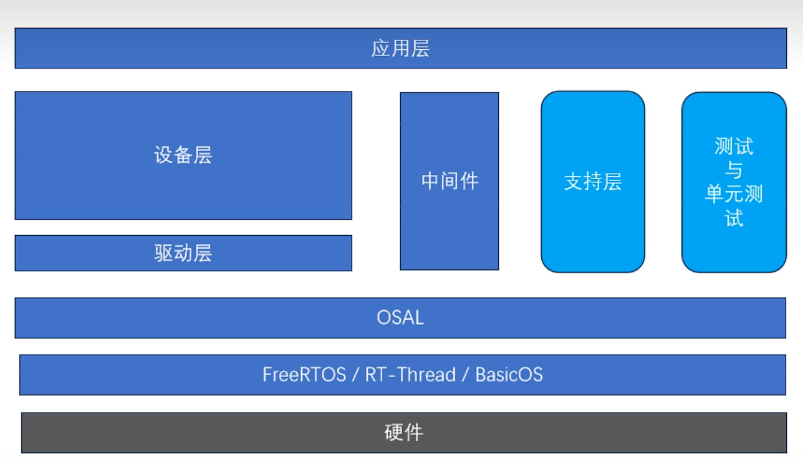

+++
author = "chen"
title = "单片机——面向对象"
date = "2023-08-07"
description = "单片机专题之面向对象"
categories = [
    "单片机"
]
tags = [
    "单片机","面向对象"
]
+++

### 嵌入式软件框架

### 内存碎片化问题

#### 内存申请存在的情况

1、大块内存申请（容易）

2、生命周期很长的内存块（容易）

3、生命周期很短的小内存块（这种不容易产生）

#### 如何解决

**动静结合**

第一种就尽量避免，干脆使用静态的

第二种可以用静态的，反正生命周期长，很久释放的不如就用静态的

**不同类型的内存块，分开管理**

大的就到大的堆申请，小的就到小的堆申请

**内存池代替内存堆**

优点速度快

**单元测试，解决验证问题**

#### FreeRTOS内存管理机制

**HEAP1:只申请，不释放。**

可以理解为静态的内存，但比静态内存方便一些。

**HEAP2:比malloc和free快，不支持相邻块合并。**

仅支持排序，帮你找到最接近大小的内存块

**HEAP3:对malloc和free的封装，线程安全**

用互斥锁封装，实现并发安全性

**HEAP4:在HEAP2基础上，实现相邻块合并，减少碎片**

最常用的管理机制，释放时检查前面后面那个内存块是不是空闲的，是的话就合并

**HEAP5:多堆管理**

把多个堆合并一起来管理

#### μC/OS-II，QPC，CMSIS-RTOS，RT-Thread

1、内存堆：慢、碎片化

2、内存池：分配大小相同的小内存块，速度快，能尽量避免内存碎片化问题

#### RT-Thread内存管理机制

**小内存管理算法：2MB。**

以2mb为界限

**Slab算法：针对资源丰富的系统的快速算法（类似于多内存池）。**

区别于Linux的优化的Slab算法，特点快，但有一定程度的浪费，不是小内存就浪费不起

**memheap管理算法。**

和FreeRTOS的head5有相似之处

