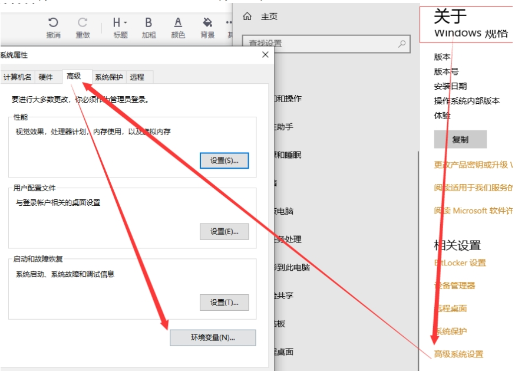
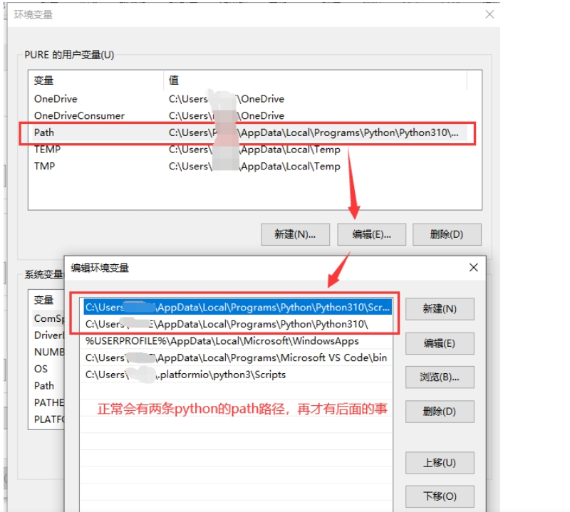
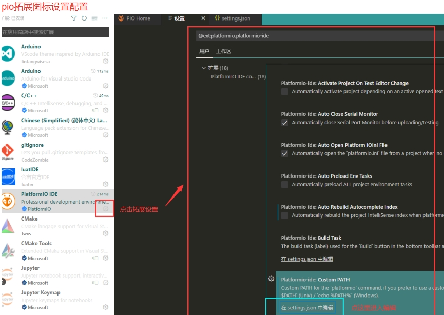
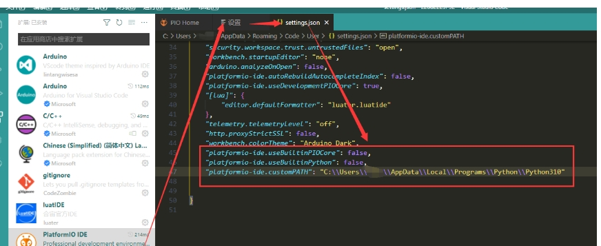
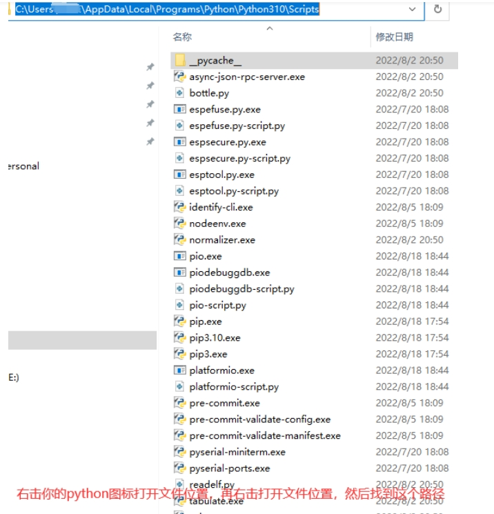
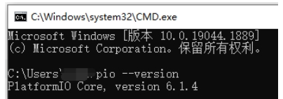
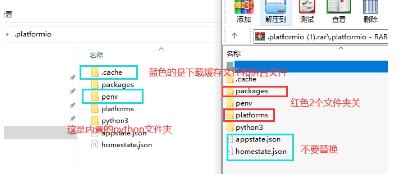
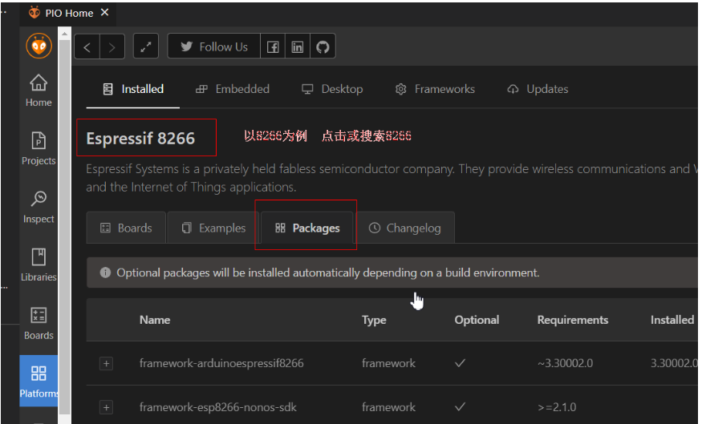
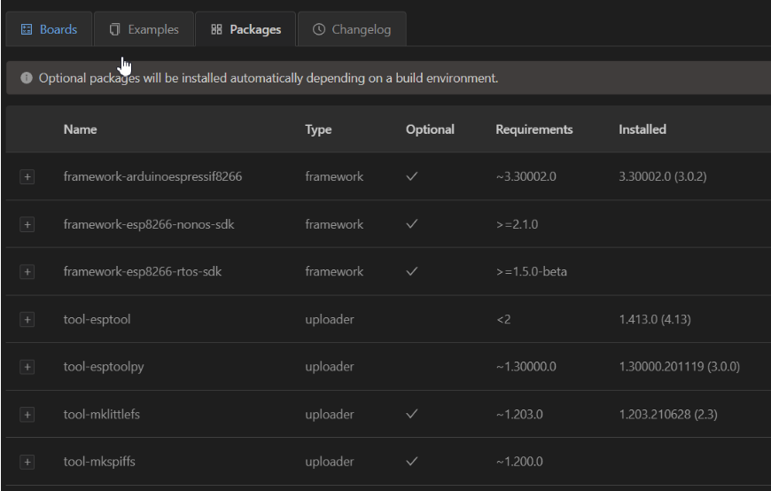
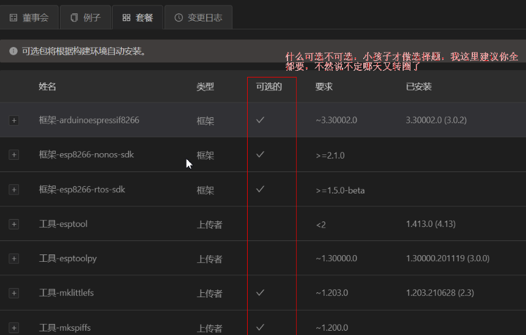

+++
author = "chen"
title = "开发工具——PlatformIO"
date = "2024-5-21"
description = "PlatformIO开发环境的安装"
categories = [
    "开发工具"
]
tags = [
    "开发工具","PlatformIO"
]
+++

# VScode插件platformIO开发环境的安装

1、准备好VSCODE Python的安装文件，安装python时把python的path选项勾选，在vscode的插件里搜索platformio添加，然后在终端里运行

```shell
pip install -i https://pypi.tuna.tsinghua.edu.cn/simple platformio
```

PIP安装Platform Core

2、检查python环境配置，右击我的电脑【安装pyth勾选path的可跳过】





3 徽标+R运行cmd 执行pio --version

在pio设置里json添加，其实这些都不是问题，下载开发环境的网络问题才是问题，不然其他开发者为什么不用这么麻烦，环境和工具全了只要看下pio版本和system info是否正常，外挂python的加上下面的三行

pio拓展图标设置配置



打开json文末加上以下三行【如图】



 "platformio-ide.useBuiltinPIOCore": false,
 "platformio-ide.useBuiltinPython": false,
 "platformio-ide.customPATH": "你的全局python路径\\\Script"【如下图路径方式加上双\\\】



3.1检查pio是否正常,不正常回第一步



**关掉VSCODE并结束相关进程，如不确定就重启电脑，复制离线包 将packages和platforms两个你从别处搞来的复制替换掉你的.platform文件夹内  默认路径 C:/Users/用户名/.platformio，**



这时候如果提示被占用 进任务管理器结束python的进程再覆盖，然后再打开vscode这时候 界面右下角不再有什么install..pio..core之类，还有等待载入这些恼火的弹窗，这是检查下环境和工具



这里有个packages，这下面的是编译工具链，你新建项目转圈等待的其实就是在下载他们，根据你开发平台要把工具链下全，不然转圈转到明年也没有用



换个中文的菜单界面你一看便知原因，从框架、编译到上传工具都是必选啊 哪里来的可选嘛



复制过来这些个文件后，这里直接建议重启电脑，再打开vs，是不是秒开了！！！
