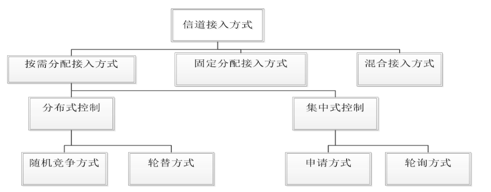
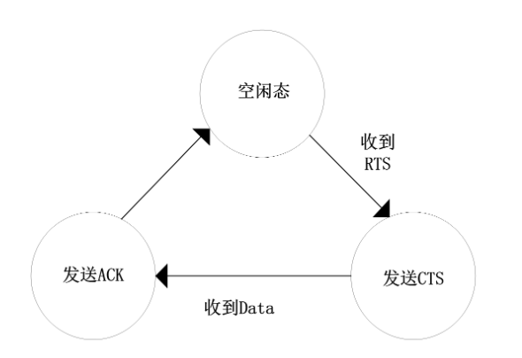
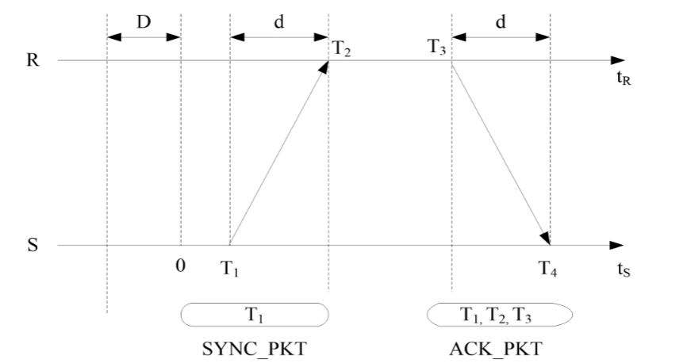

+++
author = "chen"
title = "无线传感器网络"
date = "2023-12-03"
description = "无线传感器网络"
categories = [
    "期末复习"
]
tags = [
    "期末复习","无线传感器网络"
]
+++

# 无线传感器网络考点

> 只写老师说要考点，要看完整的自己去看PPT，哈哈哈
>
> **1.物理层：传输介质，物理层接口标准，差分脉冲位置调制机制**
>
> **2.数据链路层：MAC协议，CSMA/CA，S-MAC**
>
> **3.网络层：基于数据的路由协议，Flooding协议中的“内爆”、“重叠”，SPIN（ADV、REQ、DATA），DD，基于集群结构的路由协议，基于地理位置信息的路由协议（要过程，不考原题，主要得懂）**
>
> **4.传输层：ESRT5种状态（OOR重点掌握）**
>
> **5.通信标准：EEE802.15.4，ZigBee标准**
>
> **6.节点定位：定位问题的4个前提假设，到达时间/到达时间差（ToA/TDoA），Min-max定位方法（必考），质心算法，DV-Hop算法（注意单位），APIT算法，*时间传输延迟的组成*，基于发送者-接收者的时间同步机制，基于接收者-接收者时间同步机制，RBS算法，TPSN同步算法（要画好，描述清楚，△不要错，d可以错）**
>
> 7.应用领域

### 1 物理层

**考点：传输介质，物理层接口标准，差分脉冲位置调制机制**

#### 1.1 传输介质

1.定义：包括**电磁波**（广泛，如无线电波、红外线、光波）和**声波**（水下）。

> 无线电波：低频容易产生，传播远，穿透性强，但衰减严重，高频相反，可以传播容易方向，但是和传播特性与频率有关。一般选择无需注册的公用ISM频段。
>
> 红外传输：不易被干扰拦截，保密性好，但不宜穿透非透明介质
>
> 光波传输：机制简单，耗能小，但容易受到障碍物遮挡而使通信中断

#### 1.2 物理层接口标准

1.定义：指的是各种传输介质和接口或者其他通信设备之间的约定，**解决信号传输的连接问题**，主要标准有**IEEE 802.15.4和IEEE 802.15.3a**

2.物理层协议：涉及**传输介质以及频段的选择、调制、扩频技术方式**等，还有**实现低功耗**

3.IEEE 802.15.4：**低功耗，低速率，低成本**（关键目标），**Zigbee**就是这个标准，其特性如下：

> （1）有16个信道工作于2.4GHz ISM频段，速率250kb/s
>
> （2）有一个信道工作于868MHz频段，10个915MHz频段，分别20kb/s、40kb/s，用于提高灵敏度和增大覆盖面积
>
> （3）保证低功耗电源管理，不使用就睡眠，由周期性的监听天线信道判断是否唤醒

4.IEEE 802.15.3a：超宽带（UWB）技术，高速率，短距离

#### 1.3 调制解调方式和编码方式

##### 1.3.1 差分脉冲位置调制机制（重点）

1.物理层调制解调方式：包括**脉冲位置调制机制**和**差分脉冲位置调制机制**。

> 由于无线传感器网络的传输信道是多径衰落的和随机时变的，信道状态信息会不断发生变化，信号传输过程中可能会突发严重的错误，需要采用**自适应编码调制技术**来解决信道质量波动。

2.脉冲位置调制（PPM）：一种改变脉冲发生时间的调制方式，是无线传感器网络系统**最典型的调制方式**。

> 由于在脉冲位置调制系统中，**接收端只需要检测时隙中有无脉冲**，而不需要考虑脉冲的持续时间和幅度，因此PPM相比脉冲幅度调制以及脉冲宽度调制等有较好的性能。
>
> 若采用二进制的脉冲位置调制，数据“0”调制为“01”；数据“1”调制为“10”；若为四净值的脉冲位置调制，如果传输的数据为“0312”，则经过PPM调制后数据为“0001100000100100”。

3.**差分脉冲位置调制（DPPM）**：PPM衍生，通过去除符号中多余的时隙来提高传输速率，同时因为符号以脉冲结束，所以系统**不需要符号同步**,相比PPM**系统结构简单、传输速率高**。

> 由于PPM需要时隙以及符号同步，这使接收端的复杂度较高。DPPM对PPM进行了修改，DPPM信号将对应的PPM信号中脉冲“1”后面的“0”去除，使系统的功率和带宽效率得到提高，而且DPPM信号长度是不固定的。

##### 1.3.2 自适应编码调制技术

> 基于信道状态信息确定信道容量，选择更适合的编码调制方法，针对固定用户

1.自适应编码技术

> 根据信道特性的变化，自适应地改变信道编码方式或者改变同一编码方式中的相关参数（例如码率），保证其系统整体性能不变。其实质是通过不同码率的编码增益来补偿信道衰减带来的损失。

2.自适应调制技术

> 根据信道特性的变化自适应地改变信号调制方式的技术，其目的是在一定的误码率水平下使频带利用率达到最大。
>
> 自适应调制技术的原理是，当信道特性良好时，系统载噪比增大，采用高阶调制方式使系统信息传输速率尽可能提高。当信道特性较差时，系统载噪比降低，为了保证系统的通信质量，采用低阶调制方式降低信息传输速率。

3.自适应编码调制技术

> 自适应编码调制技术的基本原理是保持发射端信号发射功率不变，根据不断变化的信道状态质量自适应地改变调制和编码方式，从而不论信道状态的好坏而获得最大的数据吞吐量，保证数据传输质量。采用自适应编码调制技术的目的在于提高传输链路频谱利用率，降低系统误比特率，保持发射功率恒定，最大程度避免对其他用户造成的干扰或者满足传输不同类型数据时的不同需求。
>
> 自适应编码调制技术大致可以分为两类：基于混合自动回询重传（HARQ）体制的自适应编码调制技术和基于信道状态信息的自适应编码调制技术。

### 2 数据链路层

**考点：MAC协议，CSMA/CA，S-MAC**

#### 2.1 数据链路层概述

无线频谱是无线通信的介质，广播介质的稀缺资源。在无线传感器网络中，可能有多个节点设备同时接入信道，导致冲突，网络吞吐量下降。为了解决这个问题，所以就有了MAC协议。

MAC协议：通过一组规则的过程来**有效、有序和公平**地使用共享介质。

##### 2.1.1 数据链路层的功能

1.定义：主要负责数据流的复用技术、数据帧检测技术、**介质访问接入技术和差错控制技术**，实现接入控制以及在节点之间建立**可靠**的通信链路。

> 数据链路层就是将PHY的物理连接链路转换成逻辑连接链路，形成一条正确的、可靠的链路。
> 数据链路层同时也向它的上层，即网络层提供透明的数据传送服务，主要包括数据流**多路复用、数据帧监测、媒体介入和差错控制**，使得**无线传感器网络内点到点、点到多点都能顺利连接**。

2.功能

> 1.成帧（帧同步）
>
> 2.差错控制
>
> 3.流量控制
>
> 4.链路控制
>
> 5.MAC（介质访问控制）寻址

##### 2.1.2 主要研究内容

1.主要内容：MAC和差错控制

> 差错控制有**自动请求、前向纠错两种方式**。
>
> MAC协议解决的是**节点接入信道的时机问题**。好的MAC协议可以实现较短时间接入需要发送数据的节点，并保证信号不频繁地冲突。

##### 2.1.3 关键问题

数据链路层设计需要考虑一些关键问题保证数据安全、准确、持续地传输。首要问题就是**传输的安全**。此外还有：

> 网络性能的优化
>
> 跨层优化
>
> 能量效率问题
>
> 公平性问题

#### 2.2 MAC协议概述

##### 2.2.1 MAC协议基础

1.信道接入机制

2.隐终端和暴露终端

> 隐终端：在发送节点的侦听范围之外，而在接收节点的干扰范围之内的节点。

> 暴露终端：在发送节点的侦听范围之内，而在接收节点的干扰范围之外的节点。

3.MAC协议的分类

> 由于无线传感器网络广泛应用，出现了很多MAC协议，但是分类缺乏统一标准。

4.无线传感器网络对MAC协议设计的影响因素

> 无线传感器节点对MAC协议的影响
>
> 无线传感器网络的业务特性对MAC协议的影响
>
> 无线传感器网络节点拓扑结构对MAC协议的影响

5.MAC协议的设计

在设计无线传感器网络的MAC协议时，需要着重考虑以下几个方面：

> 资源受限
>
> 可扩展
>
> 网络效率

6.MAC层状态转换的实现

> MAC层的状态变量有两个，一个用来**标记射频电路的工作状态**，另一个用来标记**MAC层的工作状态**。射频电路的工作状态有**睡眠、空闲、发送、接收**。MAC层的工作状态有如下几种：**空闲、睡眠、监听、发送、退避、等待允许发送、等待数据、等待确认字符、等待冗余CTS、等待冗余数据等**。

发送端：

接收端：

7.主要能量消耗分析

在无线传感器网络中，除了正常的收发任务消耗的必要能量外，MAC层上的额外能量损耗主要来自以下几个方面：

（1）空闲侦听

在无线传感器网络中的接收节点无法获知数据的准确到达时间，而且每个节点还要侦听各节点的拥塞状况，因此节点需要始终保持侦听状态，这就造成了许多没必要的侦听，导致了能量的浪费，这是节点能量消耗的最主要来源。在数据密度较低的网络应用中，空闲侦听消耗的能量也是很大的。

（2）碰撞冲突：当两个或以上的节点在同一个时刻向同一个节点发送数据包，在接收节点处会发生冲突，如图（a）。

（3）串扰：在网络中，每个节点发送消息的形式是广播发送，不是点对点的形式，只要是处在发送节点广播范围内的节点就可能接收到数据包，而这些数据包可能是发送给其它节点的，这就造成了串音干扰，如图（b）。

#### 2.3 CSMA/CA

所谓的CSMA/CA机制是指在信号传输之前，发射机先侦听介质中是否有同信道载波，若不存在，意味着信道空闲，将直接进入数据传输状态；若存在载波，则在随机退避一段时间后重新检测信道。

CSMA/CA机制:当某个站点（源站点）有数据帧要发送时，检测信道。若信道空闲，且在DIFS时间内一直空闲，则发送这个数据帧。发送结束后，源站点等待接收ACK确认帧。如果目的站点接收到正确的数据帧，还需要等待SIFS时间，然后向源站点发送ACK确认帧。若源站点在规定的时间内接收到ACK确认帧，则说明没有发生冲突，这一帧发送成功。否则执行退避算法。

#### 2.4 S-MAC协议

S-MAC协议是一个基于竞争的分布式MAC协议，在调节休眠时间调度表减少能量消耗的同时，还权衡了吞吐量和时延。

S-MAC应用了三种新技术：节点定期睡眠以减少空闲监听造成的能耗；临近的节点组成虚拟簇，使睡眠调度时间自动同步；用消息传递的方法减少时延。该协议基于CSMA/CA机制，引入了周期休眠侦听机制来减少空闲侦听，节点的休眠侦听将持续多帧。

S-MAC协议采用下面介绍的多种机制来减少了节点能量的消耗：

（1）周期性的侦听和睡眠

（2）流量自适应侦听机制

（3）碰撞和串音避免

（4）消息传递技术

> （1）周期性侦听和睡眠机制S-MAC协议将时间分为帧，帧长度由应用程序决定。帧内分监听工作阶段和睡眠阶段。监听/睡眠阶段的持续时间要根据应用情况进行调整。当节点处于睡眠阶段时，关闭无线电波，以节省能量。当然节点需要缓存这期间收到的数据，以便工作阶段集中发送。
>
> （2）流量自适应侦听机制流量自适应侦听机制的基本思想是在一次通信过程中，通信节点的邻居在通信结束后不立即进入睡眠状态，而是保持侦听一段时间。如果节点在这段时间内接收到RTS分组，则可以立刻接收数据，无须等到下一次调度侦听周期，从而减少了数据分组的传输延迟。如果在这段时间内没有接收到RTS分组，则转入睡眠状态直到下一次调度侦听周期。
>
> （3）冲突和串音避免机制为了减少冲突和避免串音，S-MAC协议采用了与802.11MAC协议类似的虚拟和物理载波监听机制，以及RTS/CTS握手交互机制。两者的区别在于当邻居节点处于通信过程时，执行S-MAC协议的节点进入睡眠状态。
>
> （4）消息传递机制S-MAC协议采用了消息传递机制，可以很好地支持长消息的发送。由于无线信道的传输差错与消息长度成正比，短消息传输成功的概率要大于长消息。

具有相同调度的节点形成一个所谓的虚拟簇，边界节点记录两个或多个调度。如果传感器网络的部署范围较广，可能形成众多不同的虚拟簇，使得S-MAC协议具有良好的可扩展性。

为了适应新加入节点，每个节点要定期广播自己的调度信息，使新节点可以与已经存在的相邻节点保持同步。如果节点同时收到两种不同的调度，如图所示的处于两个不同调度区域重合部分的节点，那么这个节点可以选择先收到的调度，并记录另一个调度信息。

### 3 网络层

**基于数据的路由协议，Flooding协议中的“内爆”、“重叠”，SPIN（ADV、REQ、DATA），DD，基于集群结构的路由协议，基于地理位置信息的路由协议（要过程，不考原题，主要得懂）**

#### 3.1 基于数据的路由协议

在以数据为中心的路由技术中，重点是获取和传播特定类型或具有某种属性的信息，而不是从特定节点收集数据。在基于数据的路由协议中，网络的各个节点地位平等，不存在等级和层次差异，路由简单，无需进行任何架构维护，不易产生瓶颈效应，具有较好的健壮性。

典型的以数据为中心的协议有Flooding、SPIN、DD、RR、SAR等。这类协议通常的模式是汇聚节点对网络发送查询信息，查询信息包括感兴趣的区域和感兴趣的数据。节点在接收到查询信息时按查询信息的要求，把数据信息发送出去。此过程节省了冗余数据在传输过程中的能量。

1.Flooding

它是一种最早的路由协议，不要求网络拓扑结构的维护和路由计算。传感节点检测到消息以广播的形式转发报文到所有的邻居节点，直到数据到达汇聚节点。

如下图所示，源节点A希望发送一段数据给基站，那节点A首先通过网络将数据分组传送给它的邻居节点（即B、C、E）。而这些邻居节点又将数据传输给除给它们发送数据分组的节点A外的各自的邻居节点。按此过程一步步传递下去，一直到把数据传输到基站为止。

2.SPIN

SPIN通过协商机制和能量自适应机制来解决传统的Flooding协议中的“内爆”、“重叠”、资源浪费等问题。

“内爆”，即多份相同信息在网络中传输。“重叠”，即同一区域多个节点可能同时发现相同现象或目标的检测对象。

SPIN中使用3种类型的消息进行通信，即广告消息（ADV）、请求消息（REQ）和数据消息（DATA）。当感测节点感测到新资料要向汇聚节点传送时，SPIN会首先发送仅包含DATA数据描述机制的ADV信息给其周围的邻居节点，接收到信息的传感器节点要根据各自特点判断是否要帮助来源节点传送资料，假如选择了帮忙传送资料，接下来就需要给来源节点发送要求接收资料的封包，此时来源节点接收到相应的REQ请求信息再将资料发送给要请求接收封包的节点。

SPIN的运作过程如下图所示。

3.DD

定向扩散路由（DD）是一个重要的、以数据为中心的、基于查询的路由协议。传感器节点用一组属性值来命名它所生成的数据，汇聚节点采用Flooding方式传播用户兴趣消息到整个或部分监测区域内的所有节点。DD传播兴趣消息，指定范围内的节点利用缓冲机制动态维护接收数据的属性、梯度矢量等信息，在同一时间激活传感器来采集与该兴趣消息相匹配的信息。

经过节点对采集信息简单的预处理后，其会使用某些规则或者算法形成了本身到目的节点的最优路径。传感器节点把采集到的数据沿着以上确定的路径向汇聚节点传送。该协议在路由的建立时需要Flooding传播，能量和时间开销很大。

DD算法的运作过程如下图所示。

#### 3.2 基于集群结构的路由协议

1.LEACH

LEACH协议是一种最早被提出来数据融合的低功耗自适应分层路由算法，在分层路由协议中最具代表性。LEACH通过随机性循环地产生簇头、周期性替换簇头和更新簇结构的方法，将整个网络的能量负载平均分配到每个传感器节点中，从而可以节约网络能耗和延长网络整体生存时间。

LEACH网络结构如下图所示。

2.PEGASIS

PEGASIS协议是对LEACH协议的一种改进版本，其基本思想是节点只与周围最近的邻居节点进行通信，以期达到节约能源消耗，延长网络生存时间的目的。在假定网络的传感器节点是相同的结构且是静态传感器节点的前提下，能降低测试模式信号的发送，通过检测来锁定到离它们最近的节点。在这种方式中，网络中的所有节点来了解彼此的位置关系，链的创建采用贪婪算法，选择距离自己最近的邻节点作为下一跳节点。

#### 3.3 基于地理位置信息的路由协议

1.GPSR

GPSR是基于节点位置和数据包目的制定转发策略的路由协议。GPSR中节点只需要知道它们一跳邻节点的信息就可以确定如何转发数据包。源端用目的端的位置信息来标记这个数据包。如果一个节点知道所有邻节点的位置，中间节点就可以选择在地理位置上最靠近目的节点的邻节点来制定局部最优转发策略。每个节点依次按照上述规则重复此过程，数据包在每一跳都会逐渐接近目的节点，直到达到目的地。

总之，GPSR工作在两种不同的模式下。收到一个数据包时，节点就在其邻居表中搜索在地理位置上距离目的端最近的邻节点。假如此邻居节点更接近目的节点，数据包将会转发给此邻居节点。否则，节点进入边界转发模式并在数据包记录贪婪转发失败的位置。边缘转发模式中收到数据包时，此位置将与转发节点的位置进行比较，如果转发节点到目的节点的距离小于被记录位置到目的节点的距离，数据包将回到贪婪转发模式。

### 4 传输层

**ESRT5种状态（OOR重点掌握）**

#### 4.1 ESRT

ESRT协议属于自适应调整协议，具备将可靠性的数据通过消耗最低的能量传输给Sink节点的能力。

（1）基本思想

ESRT是通过分析传输节点目前状态下的拥塞状况和可靠性状况，确定一种最优的策略实现最优的网络性能。ESRT根据测量系统的可靠性，对系统做出对应的调整，使之最大限度地节省能量并达到可靠性指标。该协议将无线传感器网络系统分为5种状态：

$$
S_i \epsilon \lbrace (NC,LR),(NC,HR),OOR,(C,HR),(C,LR) \rbrace
$$

（2）ESRT的关键技术

为了深入了解ESRT协议，首先必须了解ESRT协议的时间和汇聚点可靠性模型，以及五种工作状态。在当前决策周期中，汇聚节点需要R个事件消息报文才能可靠地监测事件。相应地，可以定义

$$
\eta =r/R
$$

η描述了当前传输的可靠性程度。当η≥1时，当前传输是足够可靠的；而当η＜1时，当前传输是不可靠的。图5.3为在一个典型的应用环境中，η随f的变化情况。

在一个典型的应用环境中，η随f的变化情况：

假设ε为可靠性容差，可以根据η和f的取值情况，定义传输五种工作状态：

$$
OOR 状态，即 1- \varepsilon ≤ \eta ≤ 1+ \varepsilon 且 f<f_{max}
$$

$$
(NC,LR) 状态，即 \eta ≤1- \varepsilon 且 f<f_{max}
$$

$$
(NC,HR) 状态，即 \eta ≥1+ \varepsilon 且 f<f_{max}
$$

$$
(C,LR) 状态，即 \eta <1 且 f>f_{max}
$$

$$
(C,HR) 状态，即 \eta >1 且 f>f_{max}
$$

以下表格是基于当前传输状态的f更新方法：

| 当前传输状态 | 状态描述         | f更新方法                                                                    |
| ------------ | ---------------- | ---------------------------------------------------------------------------- |
| OOR 状态     | 最优工作状态     | f保持不变                                                                    |
| (NC,LR) 状态 | 无拥塞，低可靠性 | f=f/η                                                                       |
| (NC,HR) 状态 | 无拥塞，高可靠性 | f=(f/2)(1+1/η)                                                              |
| (C,LR) 状态  | 拥塞，低可靠性   | f=fη/k ，k=k+1(k的初始值为1，代表持续处于拥塞状态的次数) |
| (C,HR) 状态  | 拥塞，高可靠性   | f=f/η,k=1                                                                   |

传输状态变换流程:

ERST协议规定源传感器根据自身的缓存状态判断是否发生阻塞。

如上图所示，在当前和上个决策周期末源传感器分别缓存了b k 和b k-1 个事件消息报文，报文增量为

$$
\Delta b=b_k-b_{k-1}
$$

如果b k +Δb大于缓存的容量B，则源传感器认为发生拥塞，并且设置拥塞标志位后向汇聚节点报告。
理论分析和仿真表明，ESRT协议能够把传感器组获得的事件消息数据低能耗地、可靠地传输到汇聚节点，且具有良好的伸缩性和容错性；它的网络拓扑变化或传感器网络的密度和规模增大时，能够保持良好的性能。

### 5 通信标准

**IEEE802.15.4，ZigBee标准**

#### 5.1 IEEE802.15.4标准

##### 5.1.1 简介

在通信技术飞速发展的趋势下，人们提出了如何在自身几米范围内实现通信的问题，个人区域网（PAN）和无线个人区域网（WPAN）的概念便应运而生。其中，近距离范围内的设备依靠WAPN网络建立连接，自身几米范围内的设备通过无线的方式连接起来，相互连接成网络，且可以与Internet或者局域网相连接。1998年3月成立了IEEE802.15工作组，主要目的是在个人操作空间内为相互通信的设备提供通信标准，主要完成了WPAN网络的PHY层和MAC层的标准化工作。下面介绍IEEE802.15.4标准的特点：

1.工作频段和数据速率

IEEE802.15.4工作在工业科学医疗（IndustrialScientificMedical,ISM）频段，它定义了2.4GHz频段物理层和868/915MHz频段物理层的标准。它们都是以直接序列扩频（DirectSequenceSpreadSpectrum,DSSS）为基础，且使用的物理层数据包格式是完全相同的，主要区别在于传输速率、调制技术、工作频率和扩频码片长度。ISM频段中的2.4GHz是全球统一、无需申请的波段，有利于节约生产成本和推广ZigBee设备，2.4GHz频段物理层采用的是高阶调制技术，有16个传输速率为250kb/s的信道，这有助于获得更小的通信时延、更短的工作周期和更高的吞吐量，从而更加省电。

2.支持简单设备

短距离传输、低速率和低功耗的特点使IEEE802.15.4非常适用于简单设备。在IEEE802.15.4中总共定义了49个基本参数，包括14个PHY层基本参数和35个MAC层基本参数，这使它非常适用于计算能力和存储能力有限的简单设备。IEEE802.15.4根据设备具有的通信能力定义了全功能设备（FullFunctionDevice,FFD）和精简功能设备（ReducedFunctionDevice,RFD）两种。对于全功能设备而言，要求必须支持所有IEEE802.15.4定义的49个基本参数，而对于精简设备，在最小配置时只要求其支持IEEE802.15.4定义的38个基本参数。

3.信标方式

802.15.4能在两种方式下工作，即信标使能方式和非信标使能方式。对于前者而言，信标由协调器定期广播，以使相关设备实现同步。且在这种方式下工作时，数据的传送使用超帧结构，其结构格式由协调器定义；而后者协调器是不定期广播信标的，只有收到某设备发出请求时才会作出应答向它广播信标。

4.数据传输

在IEEE802.15.4中，存在从协调器到设备、从设备到协调器、对等设备之间的数据传输三种数据传输方式。为了体现IEEE802.15.4低功耗的独特优势，把数据传输方式分为直接数据传输、间接数据传输和时槽保障（GranteedTimeSlots,GTS）数据传输三种。

5.低功耗低功耗是IEEE802.15.4最重要的特点。因为在某些应用中，更换电池比较麻烦，甚至实际情况下是不可行的。因为对于由电池供电的简单设备，其更换电池的费用往往比较高，甚至高于设备本身的成本。所以，在数据传输过程中，引入了几种增加设备所用电池寿命或节省功率的机制。

6.自配置

IEEE802.15.4在MAC层中加入了关联和分离功能成功实现自配置。自配置除了能自动建立起一个星状网外，还允许创建自配置的对等网。在关联过程中可以实现各种配置，例如设定电池寿命延长选项，为设备配置16位短地址等。

##### 5.1.2 协议栈

IEEE802.15.4协议主要在自动化控制、读表自动化和传感器网络等领域内使用，其网络协议栈体系结构如下图所示，它基于OSI协议栈中的每一层都实现一部分通信功能，并向高层提供服务。

IEEE802.15.4标准只定义了PHY层和MAC层。其中，PHY层是由射频收发器和底层的控制模块构成的，MAC层的功能是为高层访问物理信道提供点到点通信的服务接口。

1.PHY层

PHY层位于设备节点的最底层，射频收发器和MAC层之间，定义了物理无线信道和MAC层之间的接口，参考模型如下图所示，主要作用是实现并保证信号的有效传输，因此PHY层涉及与信号传输有关的各个方面，包括信号的发生，信号的发送与接收，数据信号传输方式是同步还是异步等。主要提供PHY层数据服务和PHY层管理服务。

2.MAC层

MAC层提供MAC数据服务和MAC管理服务，MAC数据服务通过MAC公共部分子层服务访问点提供，主要负责MAC协议数据单元在物理层数据服务中的正确发送和接收。MAC管理服务通过MAC层管理实体服务访问点提供，主要维护存储MAC层协议状态相关信息的数据库。MAC层参考模型如下图所示。

#### 5.2 ZigBee标准

##### 5.2.1 网络层规范

ZigBee网络层负责向应用层提供合适的服务接口，并提供保证IEEE802.15.4MAC层正确操作的函数。如下图所示，为了向应用层提供服务接口，网络层为应用层提供了两种必须的功能服务实体：网络层数据实体（NLDE）和网络层管理实体（NLME）。

1.网络层数据实体

NLDE提供的服务是允许应用程序在两个或多个同处在一个内部PAN中的设备间传输应用协议数据。NLDE提供的主要服务有：生成网络层协议数据单元、指定拓扑传输路由和安全。

2.网络层管理实体

NLME提供的管理服务是允许应用程序与协议栈交互，应用与堆栈相互作用。其中，寻址是指ZigBee协调器和路由器能够为新加入网络的设备分配地址；邻居设备发现是指能够发现、记录和汇报有关邻居设备的信息；路由发现是指能够发现和记录有效传送信息的网络路由；接收控制是指能够控制接收机的接收状态，从而确保MAC层的正常接收。

##### 5.2.2 应用层规范

ZigBee的应用层主要包括应用支持子层（APS子层）、ZigBee设备对象ZDO（包括ZDO管理平台）和制造商定义的应用对象。应用支持子层负责维护绑定列表，在绑定设备间传送消息。ZDO负责定义设备在网络中的角色（如ZigBee协调器或终端设备），在网络中发现设备并判断他们提供怎么样的应用服务，初始化或响应绑定要求，在网络设备间建立安全关系。

1.应用层框架

ZigBee中的应用层框架的功能是为驻扎在ZigBee设备中的应用对象提供活动的环境。

2.应用支持子层

应用支持子层通过一系列常规服务提供网络层和应用层之间的接口，同时被ZigBee设备对象和生产商定义的应用对象使用。

（1）应用支持子层数据实体应用支持子层数据实体负责为网络层、ZDO和应用对象提供服务，使应用层PDU在同一个网络内的两个或多个设备之间传输。

（2）应用支持子层管理实体应用支持子层管理实体提供管理服务，使应用程序与协议栈进行交互。

3.ZigBee设备对象

ZigBee设备对象提供了应用对象、设备描述和应用支持子层间的接口。在ZigBee协议栈结构中，ZDO位于应用架构和应用支持子层之间，满足ZigBee协议栈中应用操作的所有基本要求。主要负责初始化应用支持子层、网络层、安全服务提供层以及应用层中端点号1至240之外的ZigBee设备层及实现网络安全、设备发现、绑定管理等功能。

4.设备发现

设备发现是指ZigBee设备能发现其他设备的过程。存在IEEE地址请求和网络地址请求两种形式的设备发现请求。IEEE地址请求是单播到一个特殊的设备且假定网络地址是已知的。网络地址请求是广播且携带一个已知的IEEE地址作为负载。

### 6 节点定位

**定位问题的4个前提假设，到达时间/到达时间差（ToA/TDoA），Min-max定位方法（必考），质心算法，DV-Hop算法（注意单位），APIT算法**

#### 6.1 定位问题的一般前提假设

（1）网络具有较高的密度。

（2）网络内每一个节点具有全网唯一的ID。

（3）在没有特别说明的情况下所有节点具有相同的最大通信距离。

（4）在定位过程中假设节点相对位置不变。

#### 6.2 基于测距的定位技术

常见的测距机制分为到达时间测距机制、到达角度测距机制和接收信号强度测距机制。

1.TOA简介

其中，到达时间TOA测距机制又分为到达时间TOA和到达时间差TDOA。

TOA测距算法的基本原理是距离等于速度和时间的乘积。速度即信号的传播速度，时间即信号从起节点到终节点的传播时间。假设求两个时间同步的节点之间的距离，起节点发送声波信号时，也将发送信号的时间一同发送给终节点，这样终节点在检测到声波信号后，信号传播时间已知，信号传播速度已知，根据公式就能计算出起节点到终节点的距离。

到达时间/到达时间差(ToA/TDoA)

这类方法通过测量传输时间来估算两节点之间距离，精度较好。

ToA机制是已知信号的传播速度，根据信号的传播时间来计算节点间的距离。

在基于TDoA的定位机制中，发射节点同时发射无线射频信号和超声波信号（两种传播速度不同的无线电波信号），接收节点记录下这两种信号的到达时间T1、T2，已知无线射频信号和超声波的传播速度为c 1 、c2,那么两点之间的距离为(T2-T1)*S，其中S=c1*c2/(c1-c2)。

2.接收信号强度指示

接收信号强度测距机制是指根据信号发射过程中信号发射使得强度和被接收到时的强度的差值，得到在传播过程中的损耗，利用该损耗计算出发射节点与接受节点之间的距离。由于该技术容易实现，对硬件要求低，所以在一些领域中都有使用。

接收信号强度测距定位在实际应用中，受外界环境影响较大导致计算有很大的不稳定性，误差较大，定位精度低，所以尽管该算法功率低、成本小，但并未得到广泛应用。

到达角(AoA)

该方法通过配备特殊天线来估测其它节点发射的无线信号的到达角度。

AoA测距技术易受外界环境影响，且需要额外硬件，它的硬件尺寸和功耗指标不适用于大规模的传感器网络，在某些应用领域可以发挥作用。

6.3 Min-max定位

多边定位法的浮点运算量大，计算代价高。Min-max定位是根据若干锚点位置和至待求节点的测距值，创建多个边界框，所有边界框的交集为一矩形，取此矩形的质心作为待定位节点的坐标。采用三个锚点进行定位的Min–max方法示例，即以某锚点i(i=1,2,3)坐标(x i,yi)为基础，加上或减去测距值d i，得到锚点i的边界框：

$$
[x_i-d_i,y_i-d_i]✖[x_i+d_i,y_i+d_i]
$$

在所有位置点[xi+di,yi.di]中取最小值、所有[xi-di,yi-di]中取最大值，则交集矩形取作：

$$
[max(x_i-d_i),max(y_i-d_i)]✖[min(x_i+d_i),min(y_i+d_i)]
$$

三个锚点共同形成交叉矩形，矩形质心即为所求节点的估计位置。

6.3 基于非测距定位技术

1.质心算法

质心定位算法的核心思想是根据某未知节点的通信范围内的锚节点组成多边形，求出其质心坐标，该坐标就是未知节点的估计坐标。

$$
(x,y)=(\frac{x_1+x_2+x_3+x_4+x_5}{5},\frac{y_1+y_2+y_3+y_4+y_5}{5})
$$

在下方图中，A、B、C、D、E、F、G为可以发送信息的锚节点，坐标分别为（xA，yA）、（xB，yB）、（xC，yC）、（xD，yD）、（xE，yE）、（xF，yF）、（xG，yG），O为未知节点，坐标假设为（x，y），利用质心算法计算出的未知节点的坐标如式：

$$
(\begin{matrix}x\\ y \end{matrix})=(\begin{matrix}(x_A+x_B+x_c+x_D+x_E+x_F+x_G)/7\\ (y_A+y_B+y_c+y_D+y_E+y_F+y_G)/7 \end{matrix})
$$

2.APS算法

（1）DV-Hop算法

DV-Hop利用典型的距离向量机制进行定位。其基本思想是，未知节点与锚节点之间的距离用平均每跳距离与未知节点和锚节点之间的跳数总数的乘积来表示。

定位过程：未知节点计算到每个锚节点的跳数、计算平均每跳距离和计算未知节点坐标

下面我们举DV-Hop算法的一个简单的例子。

A、B、C是锚节点，O是未知节点。A、B之间的距离为30m，跳数为2跳，B、C之间的距离是60m，跳数为5跳，A、C之间距离是100m，跳数为6跳。

则我们可以根据公式得到A的平均每跳距离为C1，B的平均跳距为C2，C的平均跳距为C3，公式如下：

$$
C_1 = \frac{\sqrt{(x_1-x_2)^2+(y_1-y_2)^2}+\sqrt{(x_1-x_3)^2+(y_1-y_3)^2}}{h_{12}+h_{13}}=\frac{30+100}{2+6}=16.25m
$$

$$
C_2 = \frac{\sqrt{(x_2-x_1)^2+(y_2-y_1)^2}+\sqrt{(x_2-x_3)^2+(y_2-y_3)^2}}{h_{12}+h_{13}}=\frac{30+60}{2+5}=12.86m
$$

$$
C_3 = \frac{\sqrt{(x_3-x_1)^2+(y_3-y_1)^2}+\sqrt{(x_3-x_2)^2+(y_3-y_2)^2}}{h_{12}+h_{13}}=\frac{100+60}{6+5}=14.55m
$$

3.APIT算法

PIT是最佳三角形内点测试法，即测试未知节点是在三个锚节点所组成的三角形内部还是外部。

如下图所示，点M与另外三个节点A、B、C所组成三角形处于同一平面，如果存在这样一个方向使得节点M沿着该方向移动则该节点会同时接近或远离三角形的任一节点，则可判断此节点在三角形外，否则，则可判断此节点在三角形内部。内点测试的示意图如下：

APIT是由T.He等人提出一个类似于质心算法的利用三角形内点测试进行节点位置约束的定位算法。APIT即近似三角形的内点测试法，在该算法中，每个未知节点对自己附近所有的锚节点的相关信息进行监听，假设其邻居锚节点数目为n，则每次从这n个锚节点中取出3个锚节点组成一个三角形，共有Cn3种不同的组合，对于每种组合进行测试分析，判断未知节点是否位于对应组合所组成的三角形内部最后统计出所有包含未知节点的三角形组合，再而计算出所统计的三角形组合重叠区域的重心，并将该重心的位置作为待定位节点的位置。

### 7 时间同步

***时间传输延迟的组成*，基于发送者-接收者的时间同步机制，基于接收者-接收者时间同步机制，RBS算法，TPSN同步算法（要画好，描述清楚，△不要错，d可以错）**

#### 7.1 基于接收者-接收者时间同步机制

如下图，传感器节点无线数据链路层的广播信道特性应用于基于接收者-接收者的时间同步机制，利用一个第三方节点作为辅助节点，向广播域中的其它节点广播同步消息

当一组接收节点接收到同步消息后，通过比较各自接收到消息的本地时间计算出它们之间的时间偏差，最终实现接受者之间的时间同步。

#### 7.2 基于发送者-接收者的时间同步机制

如下图，根据时间同步消息发送的方向，基于发送者-接收者的时间同步协议又可分为单向同步机制和双向同步机制。典型的单向同步算法是DMTS算法和FTSP同步算法，典型的双向同步算法有TPSN算法。

#### 7.3 时间传输延迟的组成

时间传输延时对于时间同步所能达到的精度有很大的影响，下图是时间同步消息的端到端延迟示意图。
同步消息的时间传输延迟包含发送延时、访问延时、传播延时和接收延时。

#### 7.4 RBS同步算法

RBS算法是经典的时间同步算法，它具有实现简单，节省存储的特点，对于一些时间同步精度要求低的场合能充分满足。

其同步原理是指定某节点作为时间同步参考节点，其它节点每隔一段时间接收该节点发送的同步广播消息，收到广播消息的节点再利用本地时钟记录收到消息的时间，然后将记录的时间与相邻节点进行交换，根据两节点间接收到时间的差值，其中一个节点根据这个差值修改自己的本地时间，从而达到两个接收点的时间同步。

如下图所示，接收节点能够知道彼此之间的时钟偏移量，然后计算相对其它各节点时钟偏移的平均值，并用它对本地时钟进行相应的调整。

$$
\forall i \epsilon n,j\epsilon m:offest[i,j]=\frac{1}{m}\sum_{k-1}^{m}(T_{j,k}-T_{i,k})
$$

式中：n表示待同步节点数，m表示参考广播的数量，Ti,k表示第i个节点接收第k个参考广播的本地时刻。显然，由offset（i,j）形成的矩阵为对称阵，且对角元素为0。

RBS算法也可在多跳网络中使用，但随着网络跳数的提高，会导致同步误差积累，这样同步精度就会降低。当RBS时间同步机制在多跳网络使用时，节点的广播域可当做跳数的分界点。

节点A、B分别是不同广播域内的节点，节点C为两广播域交集处节点，它可当作消息的中转节点，能够同时接收节点A、B发送的广播消息，这样通过节点C可同时使A、B两节点时间同步。

#### 7.5 TPSN同步算法

传感器网络时间同步算法是典型的双向成对同步算法，通过传输报文的对称性，可以大幅削减同步信息时间延迟所带来的影响。TPSN同步机制中，节点间均使用双向无线链路机制，每个节点都有只属于自己的地址。TSPN算法在同步过程中可划分为两个阶段，分别为层次建立阶段和时间同步阶段，具体过程如下。

层次建立阶段的过程：根节点广播将自己的层次级别和地址打包发送给其它节点，其它节点将接收到的数据包解析，判断其层次级别然后加1作为自己的层次级别，再将此节点当作父节点，同样，它打包自己的层次级别后发送给其它节点，如此直至全网节点都拥有自己的层次级别和父节点。

层次结构建立以后，根节点通过广播同步消息开始进行时间同步阶段。层次级别为0的根节点开始广播数据包，以此启动全网络的时间同步，级别为1的节点在接收到数据包后延迟一段时间与根节点进行信息的交换，这些节点再按照根节点回复的时间信息确定自己的本地时钟，以达到与根节点在时间上的同步。类似上述过程，进行下层节点的时间同步，直到达到全网时间同步。

相邻级别节点间的同步机制：邻近级别的两个节点对间通过交换两个消息实现时间同步。

边节点S在T1时间发送同步请求分组给节点R，分组中包含S的级别和T1时间。节点R在T2时间收到分组，

$$
T_2=(T_1+d+ \Delta)
$$

，然后在T3时间发送应答分组给节点S，分组中包含节点R的级别和T1、T2和T3信息。

节点S在T4时间收到应答，因此可以推导出右面算式：

$$
T_4=(T_3+d-\Delta)
$$

节点S在计算时间偏差之后，将它的时间同步到节点R。

$$
\Delta=\frac{(T_2-T_1)-(T_4-T_3)}{2}
$$

$$
d=\frac{(T_2-T_1)+(T_4-T_3)}{2}
$$

### 8 应用领域
