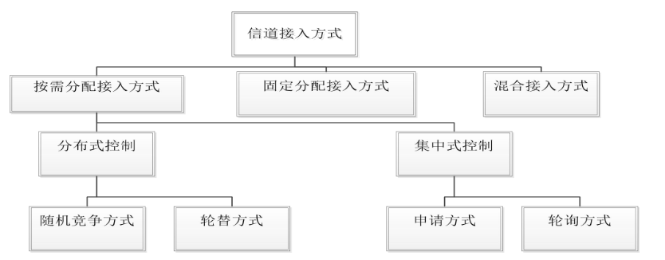
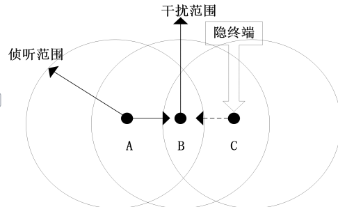
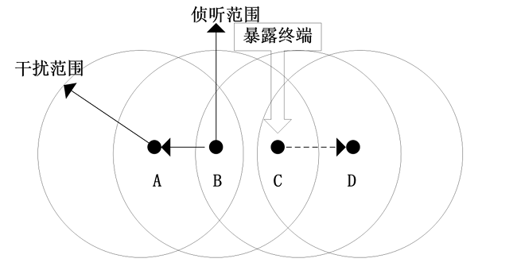
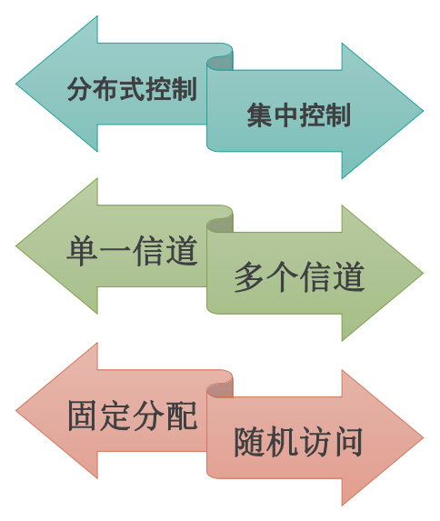

+++
author = "陈保池"
title = "无线传感器网络（持续更新中）"
date = "2023-08-30"
description = "无线传感器网络"
categories = [
    "期末复习"
]
tags = [
    "期末复习","无线传感器网络"
]
+++

# 无线传感器网络考点

> 1.物理层：传输介质，物理层接口标准，差分脉冲位置调制机制
>
> 2.数据链路层：MAC协议，CSMA/CA，S-MAC
>
> 3.网络层：基于数据的路由协议，Flooding协议中的“内爆”、“重叠”，SPIN（ADV、REQ、DATA），DD，基于集群结构的路由协议，基于地理位置信息的路由协议（要过程，不考原题，主要得懂）
>
> 4.传输层：ESRT5种状态（OOR重点掌握）
>
> 5.通信标准：EEE802.15.4，ZigBee标准
>
> 6.节点定位：定位问题的4个前提假设，到达时间/到达时间差（ToA/TDoA），Min-max定位方法（必考），质心算法，DV-Hop算法（注意单位），APIT算法，*时间传输延迟的组成*，基于发送者-接收者的时间同步机制，基于接收者-接收者时间同步机制，RBS算法，TPSN同步算法（要画好，描述清楚，△不要错，d可以错）
>
> 7.应用领域

### 1 物理层

考点：传输介质，物理层接口标准，差分脉冲位置调制机制

#### 1.1 物理层概述

1.定义：为建立、维护、释放数据链路层实体之间的二进制比特传输的**物理连接**，提供**机械的、电气的、功能的和规程**的特性。

> 机械：连接器形状尺寸连接方式
>
> 电气：比如定义3.3v是高电平还是5v
>
> 功能：各信号线的功能和定义
>
> 规程：信号线传输的工作规则、时序

##### 1.1.1 传输介质（重点）

1.定义：包括**电磁波**（广泛，如无线电波、红外线、光波）和**声波**（水下）。

> 无线电波：低频容易产生，传播远，穿透性强，但衰减严重，高频相反，可以传播容易方向，但是和传播特性与频率有关。一般选择无需注册的公用ISM频段。
>
> 红外传输：不易被干扰拦截，保密性好，但不宜穿透非透明介质
>
> 光波传输：机制简单，耗能小，但容易受到障碍物遮挡而使通信中断

##### 1.1.2 互连设备

1.定义：指的是数据终端设备（DTE）和数据电路终端设备（DCE）之间的互连设备

> 数据终端设备指的是具有发送、接收和数据处理能力的设备
>
> 数据电路终端设备指的是介于数据终端设备和传输介质的通信设备或者电路连接设备，常见的有调制解调器

物理层通信过程中，在DTE与DCE之间，既需要传输数据信息，也需要传输控制信息。DCE在DTE与传输介质之间提供**信号变换和编码功能**，并**负责建立、维护和释放物理连接**。

##### 1.1.3 物理层的主要功能：

1.为数据终端设备(DTE)提供传送数据的通路。

2.传输数据。(传输方式点到点、一点到多点、串行或并行、半双工或全双工、同步或异步)

3.其他管理工作。(如信道状态评估、能量检查等)

`物理层直接面向实际承担传输数据的物理介质`，它负责使在两个网络主机之间透明传输二进制比特流数据成为可能，`为在物理介质上传输比特流建立规则`，以及在传输介质上收发数据时定义需要何种传送技术。

除此之外还有以下功能：

> 载波侦听并反馈信道状态,降低碰撞功率
>
> 射频单元检查到有数据就接收数据,将比特流预处理成字节,提交给数据链路层用于组装成分组数据
>
> 除了调制解调/发送与接收,还为**数据链路层提供信道能量检测、链路质量指示、信道空闲评估和频率选择等服务**

##### 1.1.4 物理层接口标准

1.定义：指的是各种传输介质和接口或者其他通信设备之间的约定，**解决信号传输的连接问题**，主要标准有**IEEE 802.15.4和IEEE 802.15.3a**

2.物理层协议：涉及**传输介质以及频段的选择、调制、扩频技术方式**等，还有**实现低功耗**

3.IEEE 802.15.4：**低功耗，低速率，低成本**（关键目标），**Zigbee**就是这个标准，其特性如下：

> （1）有16个信道工作于2.4GHz ISM频段，速率250kb/s
>
> （2）有一个信道工作于868MHz频段，10个915MHz频段，分别20kb/s、40kb/s，用于提高灵敏度和增大覆盖面积
>
> （3）保证低功耗电源管理，不使用就睡眠，由周期性的监听天线信道判断是否唤醒

4.IEEE 802.15.3a：超宽带（UWB）技术，高速率，短距离

#### 1.3 调制解调方式和编码方式

##### 1.3.1 差分脉冲位置调制机制（重点）

1.物理层调制解调方式：包括**脉冲位置调制机制**和**差分脉冲位置调制机制**。

> 由于无线传感器网络的传输信道是多径衰落的和随机时变的，信道状态信息会不断发生变化，信号传输过程中可能会突发严重的错误，需要采用**自适应编码调制技术**来解决信道质量波动。

2.脉冲位置调制（PPM）：一种改变脉冲发生时间的调制方式，是无线传感器网络系统**最典型的调制方式**。

> 由于在脉冲位置调制系统中，**接收端只需要检测时隙中有无脉冲**，而不需要考虑脉冲的持续时间和幅度，因此PPM相比脉冲幅度调制以及脉冲宽度调制等有较好的性能。
>
> 若采用二进制的脉冲位置调制，数据“0”调制为“01”；数据“1”调制为“10”；若为四净值的脉冲位置调制，如果传输的数据为“0312”，则经过PPM调制后数据为“0001100000100100”。

3.**差分脉冲位置调制（DPPM）**：PPM衍生，通过去除符号中多余的时隙来提高传输速率，同时因为符号以脉冲结束，所以系统**不需要符号同步**,相比PPM**系统结构简单、传输速率高**。

> 由于PPM需要时隙以及符号同步，这使接收端的复杂度较高。DPPM对PPM进行了修改，DPPM信号将对应的PPM信号中脉冲“1”后面的“0”去除，使系统的功率和带宽效率得到提高，而且DPPM信号长度是不固定的。

##### 1.3.2 自适应编码调制技术

> 基于信道状态信息确定信道容量，选择更适合的编码调制方法，针对固定用户

1.自适应编码技术

> 根据信道特性的变化，自适应地改变信道编码方式或者改变同一编码方式中的相关参数（例如码率），保证其系统整体性能不变。其实质是通过不同码率的编码增益来补偿信道衰减带来的损失。

2.自适应调制技术

> 根据信道特性的变化自适应地改变信号调制方式的技术，其目的是在一定的误码率水平下使频带利用率达到最大。
>
> 自适应调制技术的原理是，当信道特性良好时，系统载噪比增大，采用高阶调制方式使系统信息传输速率尽可能提高。当信道特性较差时，系统载噪比降低，为了保证系统的通信质量，采用低阶调制方式降低信息传输速率。

3.自适应编码调制技术

> 自适应编码调制技术的基本原理是保持发射端信号发射功率不变，根据不断变化的信道状态质量自适应地改变调制和编码方式，从而不论信道状态的好坏而获得最大的数据吞吐量，保证数据传输质量。采用自适应编码调制技术的目的在于提高传输链路频谱利用率，降低系统误比特率，保持发射功率恒定，最大程度避免对其他用户造成的干扰或者满足传输不同类型数据时的不同需求。
>
> 自适应编码调制技术大致可以分为两类：基于混合自动回询重传（HARQ）体制的自适应编码调制技术和基于信道状态信息的自适应编码调制技术。

### 2 数据链路层

考点：MAC协议，CSMA/CA，S-MAC

#### 2.1 数据链路层概述

无线频谱是无线通信的介质，广播介质的稀缺资源。在无线传感器网络中，可能有多个节点设备同时接入信道，导致冲突，网络吞吐量下降。为了解决这个问题，所以就有了MAC协议。

MAC协议：通过一组规则的过程来**有效、有序和公平**地使用共享介质。

##### 2.1.1 数据链路层的功能

1.定义：主要负责数据流的复用技术、数据帧检测技术、**介质访问接入技术和差错控制技术**，实现接入控制以及在节点之间建立**可靠**的通信链路。

> 数据链路层就是将PHY的物理连接链路转换成逻辑连接链路，形成一条正确的、可靠的链路。
> 数据链路层同时也向它的上层，即网络层提供透明的数据传送服务，主要包括数据流**多路复用、数据帧监测、媒体介入和差错控制**，使得**无线传感器网络内点到点、点到多点都能顺利连接**。

2.功能

> 1.成帧（帧同步）
>
> 2.差错控制
>
> 3.流量控制
>
> 4.链路控制
>
> 5.MAC（介质访问控制）寻址

##### 2.1.2 主要研究内容

1.主要内容：MAC和差错控制

> 差错控制有**自动请求、前向纠错两种方式**。
>
> MAC协议解决的是**节点接入信道的时机问题**。好的MAC协议可以实现较短时间接入需要发送数据的节点，并保证信号不频繁地冲突。

##### 2.1.3 关键问题

数据链路层设计需要考虑一些关键问题保证数据安全、准确、持续地传输。首要问题就是**传输的安全**。此外还有：

> 网络性能的优化
>
> 跨层优化
>
> 能量效率问题
>
> 公平性问题

#### 2.2 MAC协议概述

##### 2.2.1 MAC协议基础

1.信道接入机制

2.隐终端和暴露终端

> 隐终端：在发送节点的侦听范围之外，而在接收节点的干扰范围之内的节点。

> 暴露终端：在发送节点的侦听范围之内，而在接收节点的干扰范围之外的节点。

3.MAC协议的分类

> 由于无线传感器网络广泛应用，出现了很多MAC协议，但是分类缺乏统一标准。

4.无线传感器网络对MAC协议设计的影响因素

> 无线传感器节点对MAC协议的影响
>
> 无线传感器网络的业务特性对MAC协议的影响
>
> 无线传感器网络节点拓扑结构对MAC协议的影响

5.MAC协议的设计

在设计无线传感器网络的MAC协议时，需要着重考虑以下几个方面：

> 资源受限
>
> 可扩展
>
> 网络效率

### 3 网络层

基于数据的路由协议，Flooding协议中的“内爆”、“重叠”，SPIN（ADV、REQ、DATA），DD，基于集群结构的路由协议，基于地理位置信息的路由协议（要过程，不考原题，主要得懂）

### 4 传输层

ESRT5种状态（OOR重点掌握）

### 5 通信标准

IEEE802.15.4，ZigBee标准

### 6 节点定位

定位问题的4个前提假设，到达时间/到达时间差（ToA/TDoA），Min-max定位方法（必考），质心算法，DV-Hop算法（注意单位），APIT算法，*时间传输延迟的组成*，基于发送者-接收者的时间同步机制，基于接收者-接收者时间同步机制，RBS算法，TPSN同步算法（要画好，描述清楚，△不要错，d可以错）

### 7 应用领域
